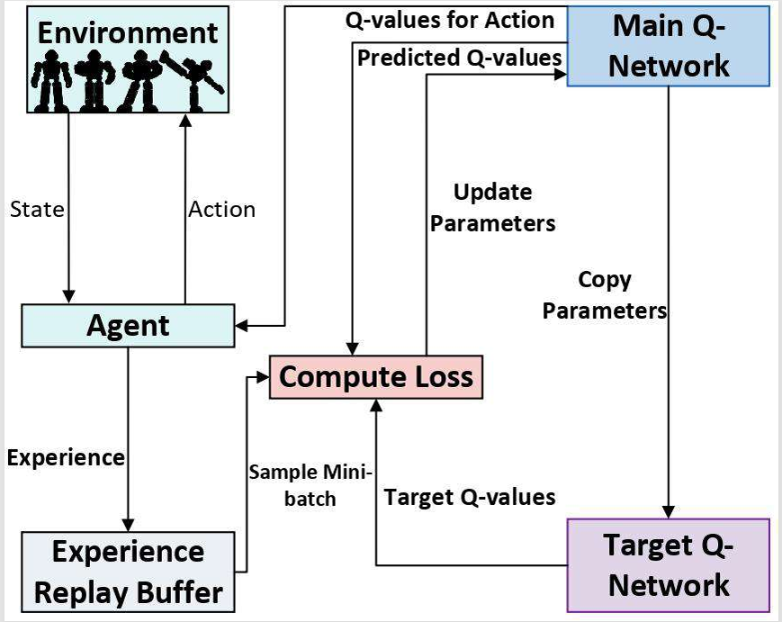

# Enhancing Test Data Generation via Path-Grouped Reusable Prioritized DQN and PSO for Mutation Testing
本项目是论文 **"Enhancing Test Data Generation via Path-Grouped Reusable Prioritized DQN and PSO for Mutation Testing"** 的官方开源实现。本仓库提供了一套完整的混合测试数据生成方法，专为解决复杂软件中变异测试的路径覆盖难题而设计，
通过将路径分组复用优先深度 Q 网络（PRP-DQN）与变异反转粒子群优化（MI-PSO）算法相结合，该框架有效缓解了标准 DQN 模型收敛慢、经验利用率低的问题，同时避免了传统进化算法容易陷入局部最优的陷阱。

## 1. 硬件与软件环境配置 
### 1.1 硬件配置
* **OS:** Windows 11 (64-bit)
* **CPU:** Intel(R) Core(TM) i5 Processor
* **RAM:** 16 GB
* **Storage:** 512 GB SSD
### 1.2 核心软件依赖
* **Python:** 3.8+
* **Deep Learning Framework:** PyTorch (自动检测 CUDA/CPU)
* **核心库:** `numpy`, `openpyxl`, `psutil`
---
## 2. 核心实验参数与代码实现细节

为了方便研究者复现本项目的实验结果，我们在下方列出了系统代码中实际运行的核心网络架构与超参数配置：

### 2.1 状态空间与动作空间 (Environment & Action Space)
* **状态定义域 (State Bounds):** $X, Y, Z \in [1, 50]$
* **动态动作增量 (Action Deltas):** 基于变量范围动态计算，正负向步长比例严格按照 **70%, 50%, 20%, 10%, 5%** 划分。
* **动作维度 (Action Dim):** **30** (3个维度 × 10个动作选项)
<p align="center">
  
  <br>
  <em>图 2: 传统 DQN 模型结构图</em>
</p>
### 2.2 PRP-DQN 模型架构 
为精准提取一维状态特征，DQN 底层采用了定制化的 **一维卷积神经网络 (1D-CNN)**：
* **卷积层 (Conv1d):**
  * 第一层：`in_channels=1`, `out_channels=32`, `kernel_size=1`
  * 第二层：`in_channels=32`, `out_channels=64`, `kernel_size=1`
* **全连接层 (Linear):**
  * 隐藏层：输入维度 192 (64×3 展平)，输出维度 **32**
  * 输出层：输入维度 32，输出维度 **30** (对应 Action Dim)

### 2.3 强化学习训练超参数 
* **优化器与学习率:** Adam Optimizer, $LR = 0.001$
* **折扣因子 (Gamma):** $0.99$
* **探索率 (Epsilon):** 初始值 $1.0$，衰减率 $0.995$，最小探索率 $0.1$
* **经验回放批大小 (Batch Size):** $32$
* **目标网络更新频率:** 每训练 **2** 次更新一次 Target Model

### 2.4 优先经验回放池 
* **优先级采样指数 (Alpha):** $0.6$
* **经验池容量 (Capacity):**
  * 高相关(相似)路径组：**10,000**
  * 低相关(孤岛)路径组：**15,000** 
### 2.5 MI-PSO 优化器参数
* **粒子群规模 (Swarm Size):** $20$
* **最大迭代次数 (Max Iterations):** $3000$
* **惯性权重 ($w$):** $0.7$
* **学习因子 ($c_1, c_2$):** $c_1 = 1.5, c_2 = 1.5$
* **最大速度限制 ($V_{max}$):** 动态限制为变量搜索范围的 **20%**

### 2.6 变异反转与梯级奖励机制
* **局部最优检测阈值 ($CV\_Threshold$):** **0.03** (当迭代 $>50$ 代且变异系数低于此值时判定为停滞)
* **反转替换策略 (Flip):** 随机抽取种群中 **20%** 的粒子，利用边界对称性生成 7 种不同的反向/变异组合并替换。
* **梯级奖励函数 (Reward Function):**
  * 基础奖励：$Jaccard\_Similarity \times 10$
  * 目标全覆盖奖励：额外 $+1.0$ (在增强训练阶段为 $+2.0$)
## 3. 核心模块简介：
* **相关性路径分组:** 基于 Jaccard 相似度计算，将变异路径划分为高相关性和低相关性集合。
* **优选状态样本筛选:** 综合评估各项指标，为后续 DQN 模型筛选出高质量的初始输入状态。
* **PRP-DQN 模型:**
  * **模型复用:** 包含为高相关性路径构建的 $DQN_H$ 以及通过参数微调复用的 $DQN_L$。
  * **优先经验回放 (Prioritized Experience Replay):** 利用时间差分误差作为指标，优先提取高价值样本以提升 DQN 训练效率。
* **MI-PSO 算法:** 引入变异系数动态监测种群停滞情况。
* **变异反转机制 (Mutation-Inversion):** 一旦检测到陷入局部最优，触发基于严重程度的反向学习机制替换冗余个体，保持种群多样性。

## 4. 核心算法与伪代码 
系统计算路径之间的 Jaccard 相似度，将输入的路径集合聚类为高相关性路径组 ($G_{high}$) 和低相关性路径组 ($G_{low}$) 。
```text
Algorithm 1: Path Grouping Based on High and Low Correlation
---------------------------------------------------------------------------
Require: Path Set Path = {P_1, P_2, ..., P_N}
Ensure: High-relevance group G_high, Low-relevance group G_low

1: Initialization: G_high <- empty, G_low <- empty, Similarity Matrix \Lambda <- 0_{N x N}
2: for i = 1 to N do
3:     for j = 1 to N do
4:         Calculate Jaccard similarity Sim(P_i, P_j)
5:         Similarity matrix \Lambda_{i,j} <- Sim(P_i, P_j)
6:     end for
7: end for
8: 
9: for i = 1 to N do
10:    Compute relevance degree \overline{\Lambda}(P_i)
11: end for
12: 
13: Compute threshold Th = (1/N) * sum_{i=1}^N \overline{\Lambda}(P_i)
14: Select Benchmark Path P_base s.t. P_base = argmax_k \overline{\Lambda}(P_k)
15: Add P_base to G_high
16: 
17: for each P_k in Path \ {P_base} do
18:    Get similarity with benchmark from similarity matrix: s_k = \Lambda_{base, k}
19:    if s_k >= Th then
20:        Add P_k to G_high
21:    else
22:        Add P_k to G_low
23:    end if
24: end for
25: 
26: return Path sets G_high and G_low
---------------------------------------------------------------------------
```

我们使用由路径相似度、路径长度差异和扰动稳定性得出的综合得分 ($Score_i$) 来评估输入状态样本 。模型在交互时采用 $\epsilon$-贪心动作选择策略，并使用基于 TD 误差的优先经验回放进行训练 。  
```text
Algorithm 2: Excellent PRP-DQN Input State Selection via Comprehensive Scores
---------------------------------------------------------------------------
Require: Original sample state set S, Path type Type \in {High, Low}, Number of high-quality samples K, Pre-trained DQN_H (reused for low-type training)
Ensure: Excellent sample input state set S_{best} (top-K samples sorted by comprehensive score)

1: if Type = High then
2:     Compute weights \omega_1, \omega_2, \omega_3 via Eq. (9)
3: else
4:     Compute weights \omega_1, \omega_2, \omega_3, \omega_4 via Eq. (12)
5: end if
6: 
7: for each sample s_i in S do
8:     Execute sample s_i and record traversed path g(s_i)
9:     Calculate core metrics: Sim_i via Eq. (5); Pl_i via Eq. (7); Rob_i
10:    if Type = High then
11:        Compute comprehensive score Score_i via Eq. (8)
12:    else
13:        Compute complementary Q-value Q_i^{comp} via Eq. (11)
14:        Compute comprehensive score Score_i via Eq. (10)
15:    end if
16: end for
17: 
18: Sort sample set S in descending order by Score_i; Select top K samples from sorted S as S_{best}
19: return S_{best}
---------------------------------------------------------------------------
```

由训练好的 PRP-DQN 提取的高回报样本构成初始粒子群 。MI-PSO 随后优化测试数据以覆盖目标路径 。如果综合变异系数 ($CV$) 低于设定阈值 ($Th_{cv} = 1.2$)，则判定种群陷入局部最优，并触发变异反转 (Mutation-Inversion) 操作 。
```text
Algorithm 3: PRP-DQN Construction and Training (Refined Version)
---------------------------------------------------------------------------
Require: High-quality sample set S_best, Target Path P_t, Max training steps M, Target network update frequency N, Batch size B, Initial priority p_init
Ensure: Trained PRP-DQN model (\theta) and ordered prioritized experience pool E_pool

1: Initialize: 
2:     Experience pool E_pool with transitions from S_best
3:     Policy network parameters \theta, Target network \theta^T <- \theta
4: Set interaction step counter t_int <- 0 and training step counter t_train <- 0
5: 
6: while t_train < M and model not converged do
7:     Update exploration rate \varepsilon via Eq. (13)
8:     
9:     Environment Interaction:
10:        Observe current state s_{t_int}
11:        Select action a_{t_int} via \varepsilon-greedy policy on Q(s_{t_int}, a; \theta)
12:        Execute action a_{t_int}, observe reward r_{t_int} and next state s'_{t_int}
13:        Store transition e_{t_int} = <s_{t_int}, a_{t_int}, r_{t_int}, s'_{t_int}, p_init> into E_pool
14:        
15:    Priority Sampling & Network Update:
16:        Sample a mini-batch B = {e_k}_{k=1}^B from E_pool with probability pro(k) \propto p_k^\alpha
17:        for each transition e_k = <s_k, a_k, r_k, s'_k, p_k> \in B do
18:            Compute IS weight w_k via Eq. (19)
19:            Compute target Q-value: y_k = r_k + \gamma * max_{a'} Q^T(s'_k, a'; \theta^T)
20:            Compute TD error: \delta_k = y_k - Q(s_k, a_k; \theta)
21:            Update priority: p_k <- |\delta_k| + \epsilon_const in E_pool
22:        end for
23:        
24:        Compute loss: L(\theta) = (1/B) * sum_{k \in B} w_k * \delta_k^2
25:        Gradient descent step to update \theta
26:        
27:        if t_train mod N = 0 then
28:            Update target network: \theta^T <- \theta
29:        end if
30:        
31:        t_int <- t_int + 1
32:        t_train <- t_train + 1
33: end while
34: 
35: Sort transitions in E_pool by descending reward r
36: return Trained model \theta and ordered E_pool
---------------------------------------------------------------------------
```

```text
Algorithm 4: PRP-DQN and Inverted MI-PSO for Path Coverage Test data Generation
---------------------------------------------------------------------------
Require: group G_high and G_low, Initial PRP-DQN model, Various parameters T_max, g_1, g_2, Th_cv, Top-\Psi selection parameter \Psi
Ensure: Test Suite T_final

1: Initialize a series of core components and parameters
2: Evaluate all particles in \bar{S} on paths in G_high or G_low
3: 
4: Phase 1: PSO Evolution for Path Coverage
5: while r <= g_1 do
6:     if \bar{S} covers l paths in G_high or G_low then
7:         Save test data of l covered paths to T_final
8:         Remove l covered paths from G_high or G_low
9:         Update remaining path counts: |G_high| <- |G_high| - l, |G_low| <- |G_low| - l
10:        Reset coverage count: l <- 0
11:    end if
12:    
13:    Save transitions <\bar{s}_i, g(\bar{s}_i), fit(\bar{s}_i)> for each particle \bar{s}_i in \bar{S} // Save data for PRP-DQN training
14:    Execute PSO evolution operations (velocity/position update) to generate new \bar{S}
15:    Update iteration counter: r <- r + 1
16: end while
17: 
18: Phase 2: PRP-DQN Training Trigger
19: if r = g_1 + 1 and P != empty then
20:    Invoke Algorithm 3 to train PRP-DQN with the saved particles \bar{S}
21: end if
22: 
23: Phase 3: PRP-DQN + MI-PSO for Remaining Paths
24: Select top \Psi transitions from the trained PRP-DQN to form the new particle swarm:
25:     S <- {s_1, s_2, ..., s_\Psi}
26: Evaluate fitness fit(s_i) for each particle s_i in S; Reset MI-PSO counter: r <- 1
27: Repeat Phase 1 for path coverage
28: 
29: while P is not fully covered and t < T_max do
30:    for each particle s_i in S do
31:        Path g(s_i) <- Execute(s_i)
32:        Calculate fit(s_i) using Eq. (24); c <- c + 1
33:        if fit(s_i) = 1 then
34:            Add s_i to T_final; Mark the corresponding path in P as covered
35:            continue to next particle
36:        end if
37:    end for
38:    
39:    if c = g_2 then // HB-PSO Local Optimum Avoidance
40:        Calculate Variation Coefficient CV using Eq. (25)
41:        if CV < Th_cv then // Local Optimum Detected
42:            Calculate the number of particles to update \ell using Eq. (26)
43:            Select \ell particles randomly from S
44:            for each selected particle s_j do
45:                for each dimension e do
46:                    x_new^e <- Flip(x_j^e) using Eq. (27)
47:                end for
48:                Replace s_j with the best variant from generated candidates
49:            end for
50:        else
51:            Update Velocity v_i and Position x_i (Standard PSO)
52:        end if
53:        Update Global Best (gbest) and Personal Best (pbest)
54:    end if
55:    
56:    // Update stagnation counter
57:    if gbest improved in current generation then
58:        stag_count <- 0
59:    else
60:        stag_count <- stag_count + 1
61:    end if
62:    
63:    // Particle Circulation Mechanism: Closed-loop with DQN
64:    if (t > 0 and t mod 500 = 0) or stag_count >= G_stag then
65:        Transmit S back to DQN model for re-execution to escape local optima
66:        Update S with newly generated transitions from DQN model
67:        stag_count <- 0 // Reset stagnation counter after circulation
68:    end if
69:    
70:    t <- t + 1
71: end while
72: 
73: return T_final
---------------------------------------------------------------------------
```

## 5. 快速开始 (Quick Start)

本项目设计为一键式单次独立运行系统，直接运行主脚本即可启动包含数据生成、模型训练与 PSO 优化的完整实验：

### 5.1 克隆仓库

```bash
git clone https://github.com/wang-xuzhou29/PRP-DQN-MIPSO.git
cd PRP-DQN-MIPSO
```

### 5.2 安装依赖

建议使用 Python 3.8+。如需 GPU 训练，请根据本机 CUDA 版本安装对应的 PyTorch。

```bash
pip install -r requirements.txt
```

### 5.3 运行完整实验

```bash
python "Core Algorithm Implementations/PRP-DQN/code.py"
```

该脚本会依次执行路径分组、样本生成、PRP-DQN 训练、MI-PSO 优化，并将结果导出到 `results/` 目录。

### 5.4 运行单独模块

路径分组：

```bash
python "Algorithm 1pathgrouping.py"
```

优质样本筛选：

```bash
python "Algorithm 2sample_selection.py"
```

测试数据生成：

```bash
python "Generate test data.py"
```

## 6. 仓库结构

```text
PRP-DQN-MIPSO/
├── Algorithm 1pathgrouping.py
├── Algorithm 2sample_selection.py
├── Generate test data.py
├── Core Algorithm Implementations/
│   └── PRP-DQN/
│       ├── code.py
│       ├── path_samples/
│       └── *.csv
├── path_samples/
├── Picture/
├── results/
├── docs/
│   └── REPRODUCIBILITY.md
├── requirements.txt
├── CITATION.cff
├── LICENSE
└── README.md
```

## 7. 复现实验

详细复现流程见 [docs/REPRODUCIBILITY.md](docs/REPRODUCIBILITY.md)，其中包括环境配置、主实验命令、辅助脚本、输入输出目录以及随机种子说明。

## 8. 引用

如果本仓库对你的研究有帮助，请引用对应论文：

```bibtex
@article{wang2026prpdqnmipso,
  title  = {Enhancing Test Data Generation via Path-Grouped Reusable Prioritized DQN and PSO for Mutation Testing},
  author = {Wang, Xuzhou},
  year   = {2026}
}
```

GitHub 也会自动识别仓库根目录下的 [CITATION.cff](CITATION.cff) 文件。

## 9. 许可证

本项目采用 MIT License，详见 [LICENSE](LICENSE)。
