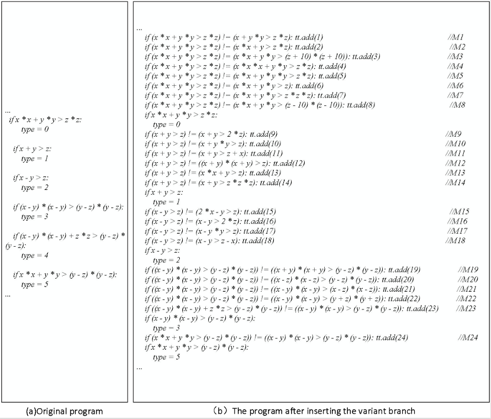
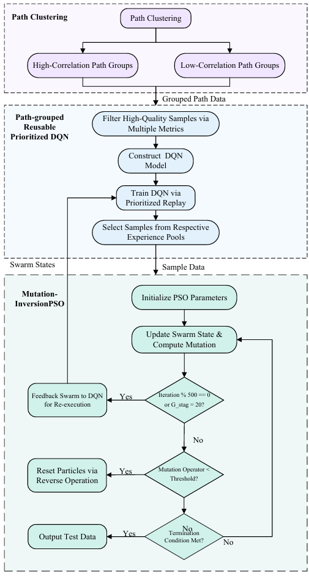

# Enhancing Test Data Generation via Path-Grouped Reusable Prioritized DQN and MI-PSO for Mutation Testing

This repository provides the official open-source implementation of the thesis **"Enhancing Test Data Generation via Path-Grouped Reusable Prioritized DQN and PSO for Mutation Testing"**.

The project implements a hybrid test-data generation framework for mutation testing and path coverage. It combines a **Path-Grouped Reusable Prioritized Deep Q-Network (PRP-DQN)** with a **Mutation-Inversion Particle Swarm Optimization (MI-PSO)** algorithm. PRP-DQN improves experience reuse and convergence efficiency compared with standard DQN, while MI-PSO helps the search escape local optima during path-oriented test-data generation.

## 1. Environment

### 1.1 Hardware

- **Operating system:** Windows 11, 64-bit
- **CPU:** Intel Core i5 or higher
- **Memory:** 16 GB RAM
- **Storage:** 512 GB SSD

### 1.2 Software

- **Python:** 3.8 or later
- **Deep learning framework:** PyTorch
- **Core dependencies:** `numpy`, `openpyxl`, `psutil`

Install all required packages with:

```bash
pip install -r requirements.txt
```

## 2. Core Experimental Settings

The following settings are used in the implemented experiments.

### 2.1 Environment and Action Space

- **State bounds:** `X, Y, Z in [1, 50]`
- **Action deltas:** Dynamic step sizes are generated from the variable ranges using the ratios `70%`, `50%`, `20%`, `10%`, and `5%`, with both positive and negative directions.
- **Action dimension:** `30`

### 2.2 PRP-DQN Architecture

The DQN backbone uses a customized one-dimensional convolutional neural network to extract features from the input state.

- **Conv1d layer 1:** `in_channels=1`, `out_channels=32`, `kernel_size=1`
- **Conv1d layer 2:** `in_channels=32`, `out_channels=64`, `kernel_size=1`
- **Hidden linear layer:** input dimension `192` (`64 x 3` after flattening), output dimension `32`
- **Output linear layer:** input dimension `32`, output dimension `30`

### 2.3 Reinforcement Learning Hyperparameters

- **Optimizer:** Adam
- **Learning rate:** `0.001`
- **Discount factor:** `gamma = 0.99`
- **Exploration rate:** initial `epsilon = 1.0`, decay rate `0.995`, minimum `epsilon = 0.1`
- **Batch size:** `32`
- **Target-network update frequency:** every `2` training steps

### 2.4 Prioritized Experience Replay

- **Priority exponent:** `alpha = 0.6`
- **Replay-buffer capacity for highly correlated path group:** `10,000`
- **Replay-buffer capacity for low-correlation path group:** `15,000`

### 2.5 MI-PSO Parameters

- **Swarm size:** `20`
- **Maximum iterations:** `3000`
- **Inertia weight:** `w = 0.7`
- **Acceleration coefficients:** `c1 = 1.5`, `c2 = 1.5`
- **Maximum velocity:** dynamically limited to `20%` of the corresponding variable range

### 2.6 Mutation-Inversion and Reward Settings

- **Local optimum detection threshold:** `CV_Threshold = 1.2`
- **Mutation-inversion operation:** When stagnation is detected, 20% of particles are selected. Boundary-symmetric variants are generated, and the best candidate is used to replace the original particle.
- **Basic reward:** `Jaccard_Similarity x 10`
- **Full target-path coverage reward:** additional `+1.0`

> Note: The coefficient-of-variation threshold is consistently set to `1.2` in this README. Please keep the implementation and thesis text aligned with this value.

## 3. Framework Overview

<p align="center">
  
  <br>
  <em>Figure 1. Overall framework of the proposed PRP-DQN and MI-PSO test-data generation method.</em>
</p>

<p align="center">
  
  <br>
  <em>Figure 2. Traditional DQN model structure.</em>
</p>

<p align="center">
  
  <br>
  <em>Figure 3. Example of the program after inserting variant branches.</em>
</p>

## 4. Core Modules

- **Correlation-based path grouping:** Paths are divided into high-correlation and low-correlation groups according to Jaccard similarity.
- **High-quality sample selection:** Initial input states are ranked by a comprehensive score that combines path similarity, path-length difference, and perturbation stability.
- **PRP-DQN model:**
  - **Model reuse:** `DQN_H` is trained for highly correlated paths, while `DQN_L` is initialized and fine-tuned from reusable parameters.
  - **Prioritized experience replay:** TD error is used to prioritize high-value samples during training.
- **MI-PSO optimization:** The coefficient of variation is monitored to detect population stagnation.
- **Mutation inversion:** Once stagnation is detected, boundary-symmetric reverse learning is triggered to maintain population diversity and improve the chance of covering difficult paths.

## 5. Algorithms

### Algorithm 1: Path Grouping Based on Correlation

```text
Require: Path set Path = {P_1, P_2, ..., P_N}
Ensure: High-correlation group G_high, low-correlation group G_low

1:  Initialize G_high <- empty, G_low <- empty, similarity matrix Lambda <- 0_{N x N}
2:  for i = 1 to N do
3:      for j = 1 to N do
4:          Calculate Jaccard similarity Sim(P_i, P_j)
5:          Lambda_{i,j} <- Sim(P_i, P_j)
6:      end for
7:  end for
8:
9:  for i = 1 to N do
10:     Compute average relevance degree mean_Lambda(P_i)
11: end for
12:
13: Compute threshold Th = (1/N) * sum_i mean_Lambda(P_i)
14: Select benchmark path P_base = argmax_k mean_Lambda(P_k)
15: Add P_base to G_high
16:
17: for each P_k in Path \ {P_base} do
18:     s_k <- Lambda_{base,k}
19:     if s_k >= Th then
20:         Add P_k to G_high
21:     else
22:         Add P_k to G_low
23:     end if
24: end for
25:
26: return G_high, G_low
```

### Algorithm 2: High-Quality PRP-DQN Input-State Selection

```text
Require: Original sample set S, path type Type in {High, Low}, top-K sample number K, reusable DQN_H
Ensure: Top-K sample set S_best ranked by comprehensive score

1:  if Type = High then
2:      Compute weights omega_1, omega_2, omega_3
3:  else
4:      Compute weights omega_1, omega_2, omega_3, omega_4
5:  end if
6:
7:  for each sample s_i in S do
8:      Execute s_i and record traversed path g(s_i)
9:      Calculate core metrics: similarity Sim_i, path-length score Pl_i, robustness Rob_i
10:     if Type = High then
11:         Compute Score_i for high-correlation paths
12:     else
13:         Compute complementary Q-value Q_i_comp
14:         Compute Score_i for low-correlation paths
15:     end if
16: end for
17:
18: Sort S by Score_i in descending order
19: Select the top K samples as S_best
20: return S_best
```

### Algorithm 3: PRP-DQN Construction and Training

```text
Require: High-quality sample set S_best, target path P_t, maximum training steps M,
         target-network update frequency N, batch size B, initial priority p_init
Ensure: Trained PRP-DQN model theta and prioritized experience pool E_pool

1:  Initialize E_pool with transitions from S_best
2:  Initialize policy network theta and target network theta_T <- theta
3:  Set interaction counter t_int <- 0 and training counter t_train <- 0
4:
5:  while t_train < M and the model has not converged do
6:      Update epsilon
7:      Observe current state s_t
8:      Select action a_t using epsilon-greedy policy Q(s_t, a; theta)
9:      Execute a_t and observe reward r_t and next state s'_t
10:     Store transition <s_t, a_t, r_t, s'_t, p_init> in E_pool
11:
12:     Sample mini-batch B from E_pool with probability proportional to p_k^alpha
13:     for each transition e_k in B do
14:         Compute importance-sampling weight w_k
15:         Compute target y_k = r_k + gamma * max_a' Q_T(s'_k, a'; theta_T)
16:         Compute TD error delta_k = y_k - Q(s_k, a_k; theta)
17:         Update priority p_k <- |delta_k| + epsilon_const
18:     end for
19:
20:     Compute weighted TD loss and update theta
21:     if t_train mod N = 0 then
22:         theta_T <- theta
23:     end if
24:
25:     t_int <- t_int + 1
26:     t_train <- t_train + 1
27: end while
28:
29: Sort E_pool by descending reward
30: return theta, E_pool
```

### Algorithm 4: PRP-DQN and MI-PSO for Path-Coverage Test-Data Generation

```text
Require: Path groups G_high and G_low, initial PRP-DQN model, maximum iterations T_max,
         PSO phase lengths g_1 and g_2, CV threshold Th_cv, top-selection parameter Psi
Ensure: Final test suite T_final

1:  Initialize particles, model parameters, and path sets
2:  Evaluate all particles on the target path group
3:
4:  while uncovered paths remain and t < T_max do
5:      Evaluate each particle and update path coverage
6:      Save covered-path test data to T_final
7:      Store particle transitions for PRP-DQN training
8:
9:      if PRP-DQN training condition is met then
10:         Train or fine-tune PRP-DQN using saved transitions
11:         Select top-Psi transitions to form or refresh the particle swarm
12:     end if
13:
14:     Calculate the coefficient of variation CV when stagnation needs to be checked
15:     if CV < Th_cv then
16:         Select particles for mutation inversion
17:         Generate boundary-symmetric variants
18:         Replace selected particles with the best variants
19:     else
20:         Update particle velocities and positions using standard PSO
21:     end if
22:
23:     Update personal best and global best
24:     if circulation condition is met then
25:         Send particles back to PRP-DQN for re-execution and swarm refresh
26:     end if
27:
28:     t <- t + 1
29: end while
30:
31: return T_final
```

## 6. Quick Start

This project is designed as a single-run experimental system. Running the main script starts path grouping, sample generation, PRP-DQN training, MI-PSO optimization, and result export.

### 6.1 Clone the Repository

```bash
git clone https://github.com/wang-xuzhou29/PRP-DQN-MIPSO.git
cd PRP-DQN-MIPSO
```

### 6.2 Install Dependencies

```bash
pip install -r requirements.txt
```

If GPU acceleration is required, install the PyTorch version that matches your CUDA environment.

### 6.3 Run the Full Experiment

```bash
python "Core Algorithm Implementations/PRP-DQN/code.py"
```

The script performs path grouping, sample generation, PRP-DQN training, MI-PSO optimization, and exports results to the `results/` directory.

### 6.4 Run Individual Modules

Path grouping:

```bash
python "Algorithm 1pathgrouping.py"
```

High-quality sample selection:

```bash
python "Algorithm 2sample_selection.py"
```

Test-data generation:

```bash
python "Generate test data.py"
```

## 7. Repository Structure

```text
PRP-DQN-MIPSO/
|-- Algorithm 1pathgrouping.py
|-- Algorithm 2sample_selection.py
|-- Generate test data.py
|-- Core Algorithm Implementations/
|   `-- PRP-DQN/
|       |-- code.py
|       |-- path_samples/
|       `-- *.csv
|-- path_samples/
|-- Picture/
|   |-- fig1.png
|   |-- fig2.png
|   `-- fig3.png
|-- results/
|-- docs/
|   `-- REPRODUCIBILITY.md
|-- requirements.txt
|-- CITATION.cff
|-- LICENSE
`-- README.md
```
## 8. Comparative Experiments

The `Experiment code/` directory contains the scripts used for the ablation studies and baseline comparisons. Each file is self-contained and can be executed independently.

| Experiment | Script | Purpose |
|---|---|---|
| Experiment One | `Experiment One.py` | Evaluates isolated paths with a four-criteria scoring strategy based on path similarity, path-length difference, robustness, and DQN-derived information. |
| Experiment Two | `Experiment Two No grouping.py` | Runs the training workflow without path grouping as the no-grouping baseline. |
| Experiment Two | `Experiment Two groups without model reuse.py` | Uses path grouping but trains grouped models independently, without transferring model parameters between groups. |
| Experiment Two | `Experiment Two Grouping and Model Reuse.py` | Uses path grouping and model reuse. The model trained on the high-correlation group is reused for the low-correlation group. |
| Experiment Two | `Experiment Two Random grouping and model reuse.py` | Replaces correlation-based grouping with random grouping while keeping model reuse. |
| Experiment Three | `Experiment Three No priority.py` | Removes prioritized replay and uses ordinary replay sampling. |
| Experiment Three | `Experiment Three Priority Granted.py` | Enables prioritized replay to evaluate priority-based experience reuse. |
| Experiment Four | `Experiment Four DQN.py` | Uses DQN as the reinforcement-learning baseline. |
| Experiment Four | `Experiment Four PPO.py` | Uses PPO as the reinforcement-learning baseline. |
| Experiment Four | `Experiment Four SAC.py` | Uses SAC as the reinforcement-learning baseline. |
| Experiment Five | `Experiment Five PSO.py` | Uses standard PSO only. |
| Experiment Five | `Experiment Five DQN+PSO.py` | Combines standard DQN with standard PSO. |
| Experiment Five | `Experiment Five PRPDQN+PSO.py` | Combines PRP-DQN with standard PSO. |
| Experiment Five | `Experiment Five PRPDQN+MIPSO.py` | Runs the proposed PRP-DQN and MI-PSO method. |

Most comparative scripts are configured for 20 independent runs by default through `NUM_RUNS = 20`. The number of runs can usually be changed by modifying `NUM_RUNS` in the script or by passing a command-line argument when supported.

## 9. Notes for Reproducibility

- Some experiments use random sampling and stochastic optimization. For strict reproducibility, set the random seeds in the corresponding scripts before running.
- Long-running experiments may require several minutes or more depending on hardware.
- The released scripts preserve the experimental logic used in the study. Users may adjust output paths, run counts, and sample sizes for local testing.

## 10. Reproducing the Experiments

Detailed reproduction instructions are provided in [docs/REPRODUCIBILITY.md](docs/REPRODUCIBILITY.md), including environment setup, main commands, auxiliary scripts, input and output directories, and random-seed settings.

## 11. License

This project is licensed under the MIT License. See [LICENSE](LICENSE) for details.
